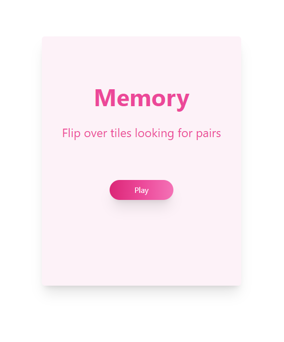
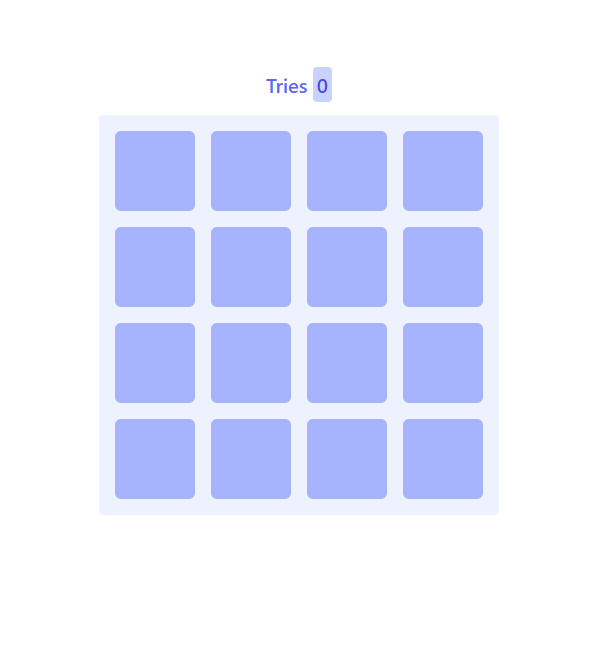
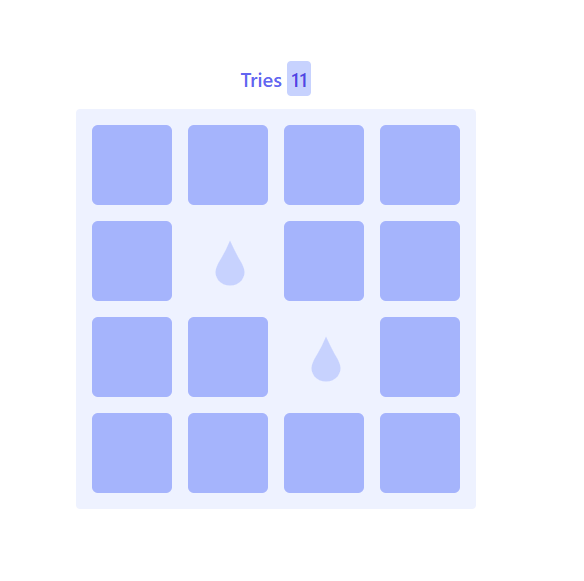
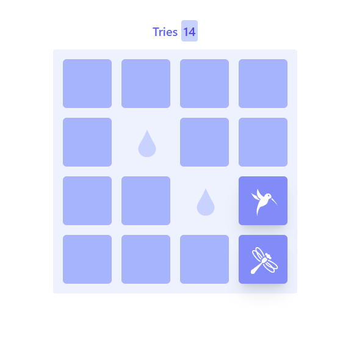

# Memory Game - Tailwind CSS

## Development

Welcome to the hackathon! Here’s how to get started.

### Editing with MightyMeld

1. Clone this repository to your local machine.

2. Change into the directory of the cloned repository: `cd MemoryGame`.

3. Run the install command: `npm install`
   
4. Make sure you have an account at [mightymeld.app](https://mightymeld.app).

5. If you do not prefer using VS Code, set up your favorite text editor (see below).

6. Start MightyMeld: `npx mightymeld`.

### Setting up your favorite text editor

You can choose “Open in Editor” in various places in MightyMeld to open files in your text editor. This project is set up to open VS Code. If you want to use a different editor, you can change the `editor` field in `mightymeld.json` to a different editor. See the [editor documentation](https://docs.mightymeld.com/docs/setup/reference/configuration#editor) for more information.

## Design

<kbd>
	
</kbd>

<kbd>
	
</kbd>
<kbd>
	
</kbd>
<kbd>
	
</kbd>

